## 编译原理实验

**基于表达式的计算器 EXPREVAL**

**设计文档**

---

[toc]

<div STYLE="page-break-after: always;"></div>

***实验描述、计算器规格说明、实验软装置见 Lab04-ExprEval.pdf**

### 1 实验环境

#### 1.1 编程语言

java语言，JDK版本1.7.2

#### 1.2 开发工具

IDE：Visual Studio Code

最终结果独立于IDE，可以直接运行在JDK上。

#### 1.3 操作系统

Windows 11


### 2 实验内容

#### 2.1 语法定义的二义性

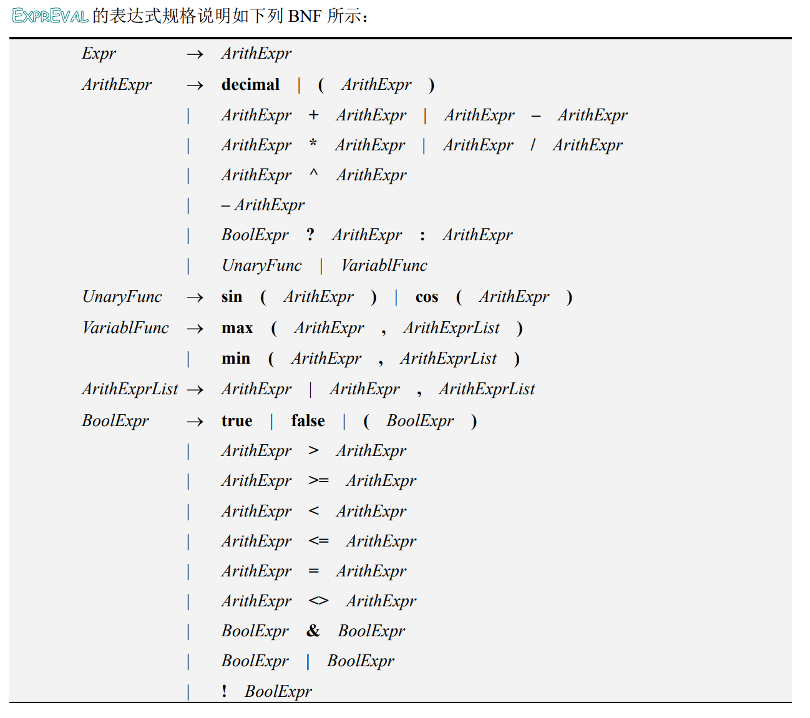

很显然，该语法具有二义性。

举一个简单的例子：decimal + decimal + decimal。这个表达式就具有两棵不同的语法树：

<table rules="none" align="center">
	<tr>
		<td>
			<center>
				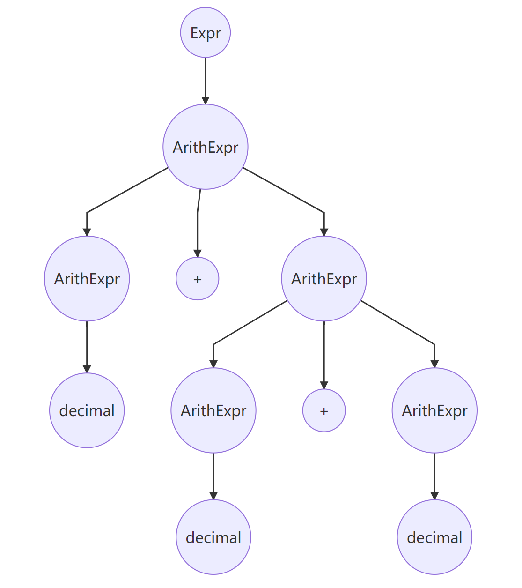
				<br/>
				<font color="AAAAAA">语法树1</font>
			</center>
		</td>
		<td>
			<center>
				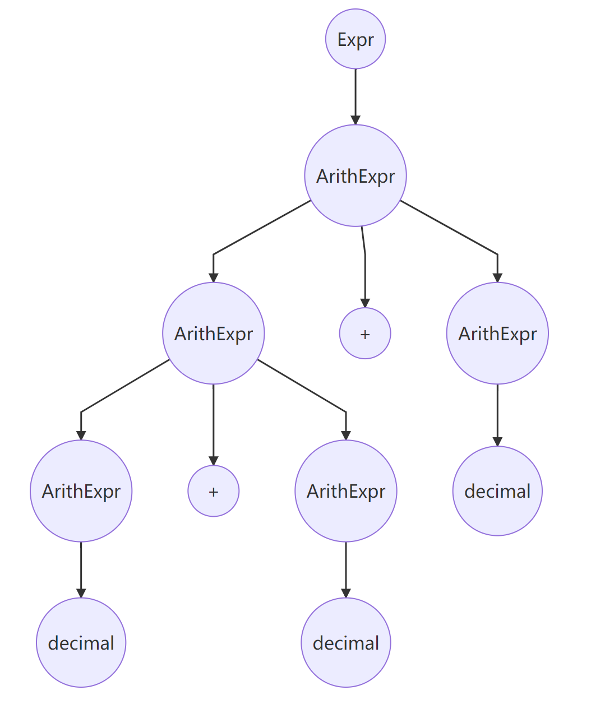
				<br/>
				<font color="AAAAAA">语法树2</font>
			</center>
		</td>
	</tr>
</table>

从这个例子中可以看出，造成该语法具有二义性的根本原因在于，符号之间没有定义优先级和结合性。简而言之，EXPREVAL想要解析这种具有二义性的语言，最好的处理方式就是设置一个规则，该规则可在每个二义性情况下指出哪一个语法树是正确的。这里的规则可以使用定义符号的优先级和结合性，使得解析的时候确定一种唯一的解析方式。这样每种表达式都只会有一种语法树，这样便可以消去语法的二义性。

因此，优先级和结合性质的定义如下：

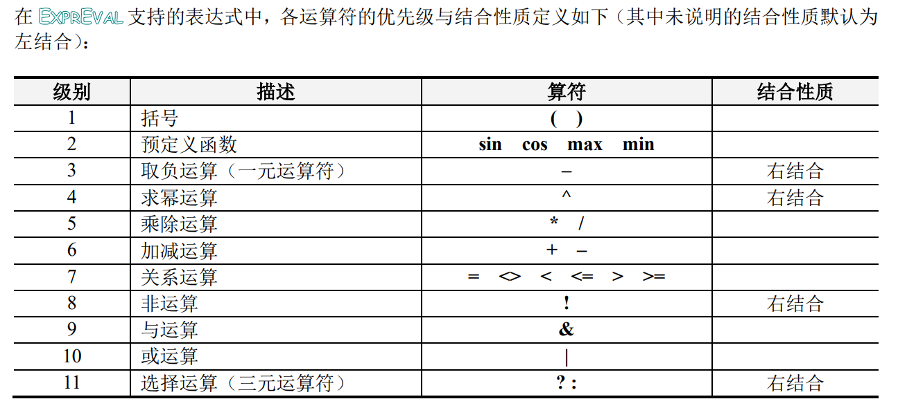


#### 2.2 词法分析器

##### 2.2.1 有限自动机

在EXPRVAL中，输入表达式支持布尔类型常量、数值类型常量（其中包括科学记数法）、各种算术运算、关系运算、逻辑运算、以及预定义函数等，在实现词法分析器前，需要根据支持的表达式语言的词法规则，绘制识别其中所有合法单词的有限自动机（状态转换图）。

除了数值常量（Decimal）的词法，其余词法都是简单的转移可以实现。由于科学计数法的数值常量在扫描的部分工作比较大，因此单独讨论数值常量的获取。数值常量的BNF如下：

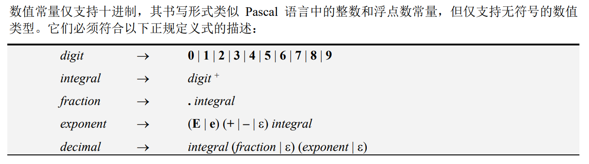

根据该BNF，得到如下有限自动机。

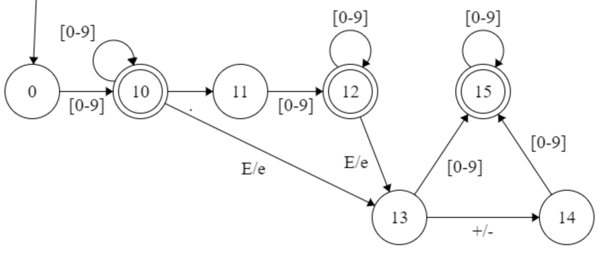

在此基础上，可以得到整个EXPRVAL中合法单词的有限自动机：

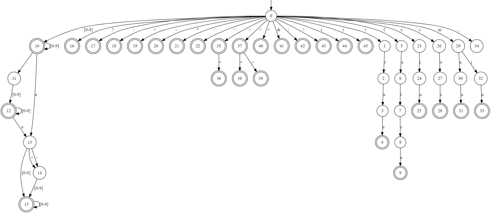

根据该DFA，只需要将整个表达式在DFA上转移，就可以获取每一个token。

##### 2.2.2 单词分类

单词的分类有两种构想：

1. 分为三类，分别表示数字常量、布尔常量和其他的操作符。
2. 分为九类，本别表示数字常量、布尔常量、函数、算术运算符、关系运算符、括号、三元运算符、一元运算符以及其他特殊标识符。

前者为我实现的2.0版本，后者为3.0版本。前后者的区别在于，后者对单词的划分更加详细。我不好说哪种分类方法更好，各有各的优点。共同点在于，无论是三类还是九类，单词的分类都是基于单词类，也就是token类的基础，也就是说，token作为一个基类，其他划分都是token的继承类。

前者的优点在于，由于划分的Token，在我的语法分析过程，并没有产生动作，因此token的类别其实对程序的影响不大，并不会因为类别划分的比较大，就影响了程序的可扩展性。事实上，除了数字常量和布尔常量有额外的常量信息，其他操作符本身除了操作符的类型和内容以外，并不包含任何的信息和动作，因此不需要进行精细的划分。在3.0版本中，进行精细划分的意义在于，这样使得程序的可读性上升。同时，由于划分得更加精细，使得程序可以使用一个类工厂模式，设置了一个工厂生产不同类别的精细单词类。同时，为了记录一些额外的信息，例如函数中的一元函数与多元函数，可以设置一个虚函数接口，用于获取少量的额外信息。前者划分的依据在于，单词之间是否有需要额外记录的信息；后者划分的依据在于，在规约后进行计算的过程中，产生的动作。因此，后者将运算符中的算术运算符和关系运算符分为两类。而之所以一元函数和多元函数归为一类，因此除了中间列表的操作外，reduce的动作两者是一致的，因此划分为同一类。

因此，归类如下：

| 类别        | 划分                                    |
| ----------- | --------------------------------------- |
| decimal     | 数值常量                                |
| boolean     | 布尔常量                                |
| operator    | 算术运算符：+  -  *  /  ^               |
| relation    | 关系运算符：<  >  < =  >=  <>  =  &  \| |
| parenthesis | 括号：(  )                              |
| function    | 函数：sin  cos  max  min                |
| unary       | 一元运算符：-  !                        |
| thriple     | 三元运算符：?  :                        |
| comma       | 逗号：,                                 |
| dollar      | 终结符：$                               |

事实上可以有很多种不同的划分方式，只不过在这种划分方式下，我的设计能够达到一种均衡。


##### 2.2.3 状态转移

先给出状态转移（扫描）的流程：

1. 在表达式的末尾加上$，即dollor（终结符）；

2. 从DFA的起点开始；

3. 获取表达式当前状态的下一个待匹配的字符，以及该字符的lookahead，在DFA上转移：

   - 若存在该转移边，转移到下一个状态；
   - 否则，抛出相应的错误；

4. 重复2，直到：

   - lookahead为dollor，即终结符；
   - 新的转移状态不存在字符为lookahead的转移边；

   则认为当前扫描的单词为一个新的单词，记录从起点开始访问过的所有边，构造一个新的token，并返回DFA的起点；

5. 重复上述步骤234，直到待匹配的字符为dollor。

根据已有的DFA和上述步骤，能够完美地处理科学计数法表示的数值常量。由于空格仅作为分隔符存在，但是表达式中一般不需要空格作为分隔符。因此，通过设置一个lookahead，通过观察该lookahead能够进行下一次转移，能够完美地处理字符串的边界问题。对于异常的处理可以观察代码中相应的部分，由于要素过多，不做赘述。

值得注意的是，在该部分中，将 “-” 从单词的角度区分为一元运算符和算术运算符。在扫描的过程中，记录当前读取的buffer中上一个token的值，若当前获取的token为 “-”，并且上一个token是数值常量、布尔常量或者右括号，则认为当前的token为算术运算符意义上的 “-”，否则认为是一元运算符意义上的 “-”。

另外一点，就是空白运算符的处理。我们仅认为，在单词之间的空格是有意义的，他们作为表达式单词之间的分隔符存在。但是在单词之间出现的空格，则认为是非法的。因此，对于空格的处理，只有当DFA在起始状态和终结状态的时候，能够读取空格，其他时刻读取空格则认为是非法的。


#### 2.3 算符优先关系表

本实验要求采用 OPP 作为语法分析技术，因而语法分析的核心问题是算符优先关系表的构造。根据算符优先表，能够处理该语法存在的二义性。

在此之前，定义算符的优先级，根据该优先级表和语法，构造算符优先表。


由于在进行规约的时候，布尔常量和数值常量的优先级是最高的，将布尔常量和数值常量的优先级定义为0。

那么，构造的算符优先表如下，其中：

- 0表示shift（绿色）
- 1表示reduce（黄色）
- 2表示accept（白色）
- -1表示缺少操作符
- -2表示缺少运算量
- -3表示缺少左括号
- -4表示缺少右括号
- -5表示三元运算符错误
- -6表示函数使用错误

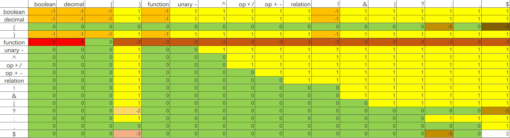

从表格中，可以看到一些设计的理念：

- 优先级高的运算符遇到优先级低的运算符，一般进行shift操作；反之，一般进行reduce操作。

- 如果操作符是右结合的，例如 ^，那么在 ^ 遇到 ^ 的时候，需要进行shift操作；

  如果操作符是左结合的，例如 +，那么在 + 遇到 + 的时候，需要进行reduce操作。

- 数值和布尔常量的优先级最高，而终结符dollar的优先级最低。

- 在遇到一些不可能出现的情况下，抛出错误，例如布尔常量的右边紧跟着左括号。

- 由于在scanner阶段，将一元 “-” 和二元 “-” 定义为两种不同的符号，因此不需要在优先表中做敏感处理。我们定义一元取负操作的优先级高于二元减法。

- 三元运算符的优先级非常低：

  "?" 在遇见所有符号都需要进行shift操作，需要找到一个 “:”，除非是右括号或者终结符，会抛出错误；

  ":" 在遇见大多数符号都同样也需要shift，除非是冒号、逗号、右括号或者终结符，需要reduce。

- 逗号的优先级是最低的，和终结符同一个量级。

- 同样优先级的算符可以归为一类，如function、relation、加减、乘除等。

- 函数只能遇见左括号，遇见其他操作符都应该抛出错误。


#### 2.4 语法分析和语义处理

##### 2.4.1 OPP核心控制部分

OPP的运作需要一个栈（stack）、一个输入队列（inpyt）以及算符优先关系表（table），其工作原理如下图所示：

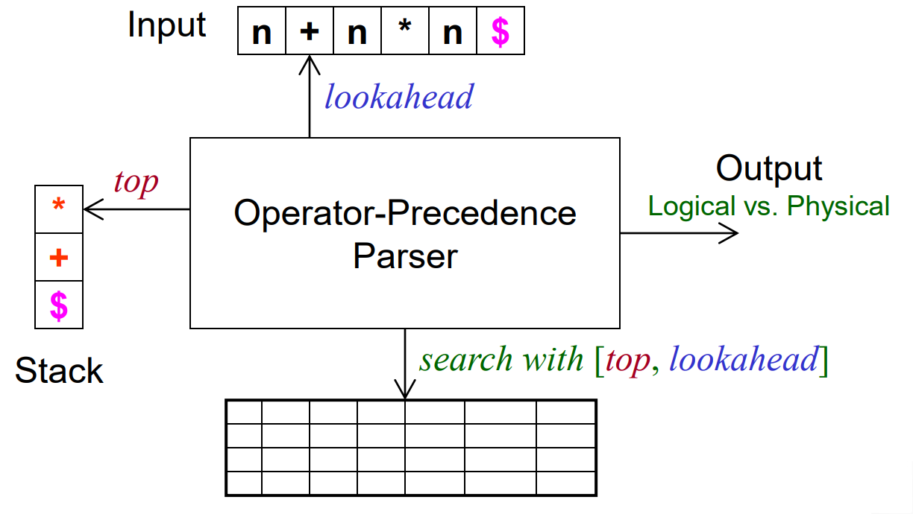

栈中用于存放当前已经读取但未处理的token，输入队列中为未读取的token，每一次output为输出的最简短语，即规约的需要处理的极简表达式。其伪代码如下：

```java
stack <- empyt
input <- tokens list of expression
stack.push("$");
while (true):
	top <- stack.top()
    lookahead <- input[0]
    switch table[top][lookahead]:
		case shift:
			shift();
			break;
		case reduce:
			reduce();
			break;
		case accept:
			accept();
            return;
		case exception:
			throw exception;
	endswitch
endwhile
```

简单来说，每次操作需要取出栈顶的元素和输入队列首的元素，根据算符优先关系表，进行相应shift、reduce、accept或者抛出错误的操作。

**shift 操作**

shift操作表现为：将输入队列首的元素放置于栈顶，并删除队列首的元素。表示当前的token目前不需要处理，等待后续元素放入。伪代码如下：

```java
function shift():
	stack.push(input[0]);
	input.erase(0);
end
```

**reduce 操作**

reduce表现为：从栈顶开始，找到第一个优先级大于输入队列首的元素，并弹出栈的顶部所有优先级小于输入队列首的元素。

```java
function reduce():
	while (table[stack.top()][input[0]] == reduce):
		result <- calcator(stack);
        stack.pop();
		stack.push(result);
	endwhile
end
```

其中，对于每次弹出的栈顶，都需要放入计算部分中进行计算。对于不同的操作符，应有不同的处理过程。这部分在2.4.3中阐述。

**accept 操作**

accept 表示，栈顶和队列首的元素都是dollar，表示整个expression都已经计算完成。此时，只需要取出栈顶的non-terminal元素，打印即可。若此时栈顶中不止一个元素，则为缺少运算符；若栈顶没有元素，则为空表达式。至于栈顶为什么会有non-terminal元素，将在2.4.2中阐述。

##### 2.4.2 栈的设计

理论意义上，对于 OPP 算法来说，stack中只应该存在terminal元素。terminal元素表现为表达式在scanner中的输出结果，是输入表达式中最原始的元素。在进行规约操作的时候，举一个简单的例子：

```
expr -> E
E -> terminal
```

那么，对于一个terminal，在一次规约后，会规约成为non-terminal的E。也就是说，non-terminal是作为一种中间产物的形式存在。在EXPREVAL中，non-terminal表现为中间计算结果，也就是说，non-terminal表现为计算产生的布尔常量和数值常量，作为计算结果。在 OPP 算法中，non-terminal是没有实际意义的，因此在对栈做任何操作的时候，我们考虑的对象仅仅是terminal，non-terminal是为了简化计算部分而存在的。换言之，在stack.top()操作中，实际上是取出栈顶的第一个terminal元素，而non-terminal将会直接忽略。

这样定义的好处在于，可以直接规定每个操作符的行为。例如，当需要规约 “+” 的时候，我们只需要取出 “+” 的上下各一个元素，进行计算即可。这样可以大幅度地减少算法的复杂度。

##### 2.4.3 计算部分

我们针对栈顶元素的不同类型，制定了不同的动作。我们将栈顶的元素记为output，针对其类型，产生的动作、返回值和异常处理如下：

其中，异常处理包括语法错误和语义错误。

| output的类型              | 动作                                                         | 返回值                                                       | 异常处理                                                     |
| :------------------------ | :----------------------------------------------------------- | ------------------------------------------------------------ | ------------------------------------------------------------ |
| decimal或者boolean        | 无                                                           | 该元素的一个non-terminal副本                                 | 无                                                           |
| operator（加减乘除幂）    | 取出output在栈顶上方和下方的一个non-terminal元素             | 取出的两个元素的操作符相应的运算结果的non-terminal副本       | output上方或者下方没有元素，则缺少运算量；如果两个元素不为decimal，则为类型不匹配的语义错误 |
| unary（取负或者取非）     | 取出output上方的一个non-terminal元素                         | 该元素取负或者取非                                           | 若上方没有元素，则缺少运算量；如果取负的上方不为decimal，或者取非的上方部位boolean，则为类型不匹配的语义错误 |
| relation（关系运算符）    | 取出output在栈顶上方和下方的一个non-terminal元素             | 取出的两个元素的操作符相应的运算结果的non-terminal副本       | output上方或者下方没有元素，则缺少运算量；若为比较运算符，如果两个元素不为decimal，则为类型不匹配的语义错误；若为布尔运算符，如果两个元素不为boolean，则为类型不匹配的语义错误 |
| parenthesis（且为右括号） | 找到 ) 下面的第一个 (，提取中括号之间的所有元素，记为args。若 ( 的下方元素为空或者不为函数，则进行常量操作；否则进行函数操作。 | 常量操作无动作，函数操作则对args做相应的函数运算             | 若常量运算的args数量大于1，返回缺少运算符；若常量运算的args为空或者不为non-terminal，返回缺少运算量；若函数是一元运算，则判断args的方法，否则同上述处理；若函数是多元运算，必须保证为args为decimal和逗号相间隔的形式 |
| thriple（且为: ）         | 找到output下方的第一个?，取出 ? 前的元素，记为A；取出 ? 后的元素，记为B；取出 : 后的元素，记为C | 如果A为真，返回B的non-terminal副本，否则返回C的non-terminal副本 | 如果没有？，返回三元运算符错误；如果？和：之间的元素数量不是1，返回缺少运算符；如果A、B或者C缺少或者不为non-terminal，返回缺少运算量；如果A不是boolean，返回类型不匹配的语义错误 |
| 其他                      | 无                                                           | 无                                                           | 缺少操作符                                                   |

这个部分体现了token的分类中的分类方式的原因：

- function的分类中记录了额外的信息：是否为一元运算符；
- relation的分类中记录了额外的信息：是否为布尔运算符；


### 3 实验设计

#### 3.1 UML

整个工程分为三个部分：token、scanner和parser。其中，token用于存储表达式中的单词，scanner用于将表达式扫描成为token列表，而parser用于语法解析。

##### 3.1.1 总体UML

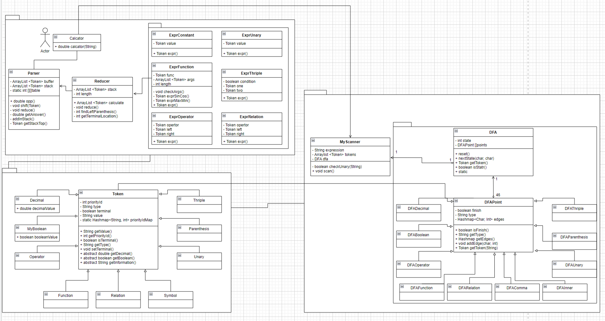

##### 3.1.2 token

token中，token作为所有单词的基类存在，保存基本的信息，而其他分类的token为Token的继承类，记录了额外的信息和动作。

其中，token部分UML如下：

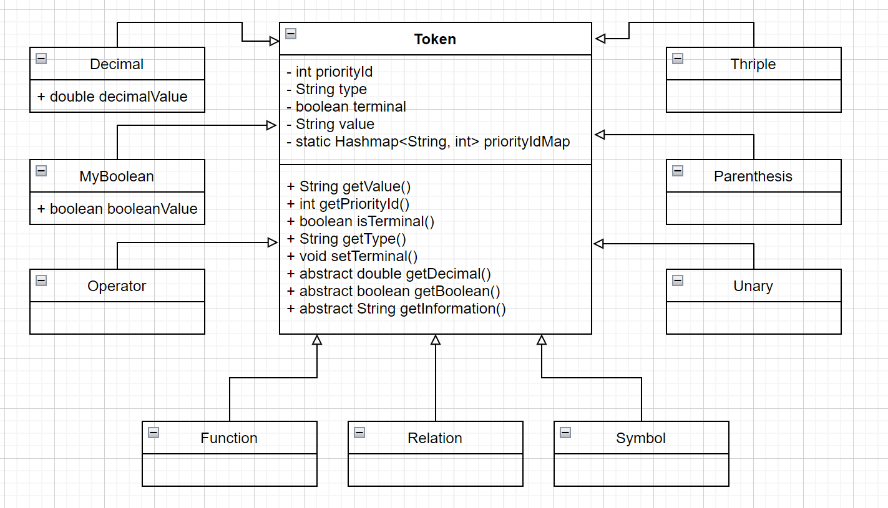

##### 3.1.3 scanner

scanner的工作需要一个有限状态自动机，DFA为静态设计，包含了46个点的状态。其中，每个状态是一个DFAPoint的继承类，非终结状态是DAFInner的实例化，而终结状态根据活前缀的类别不同，分为各种具体的DFAPoint类。

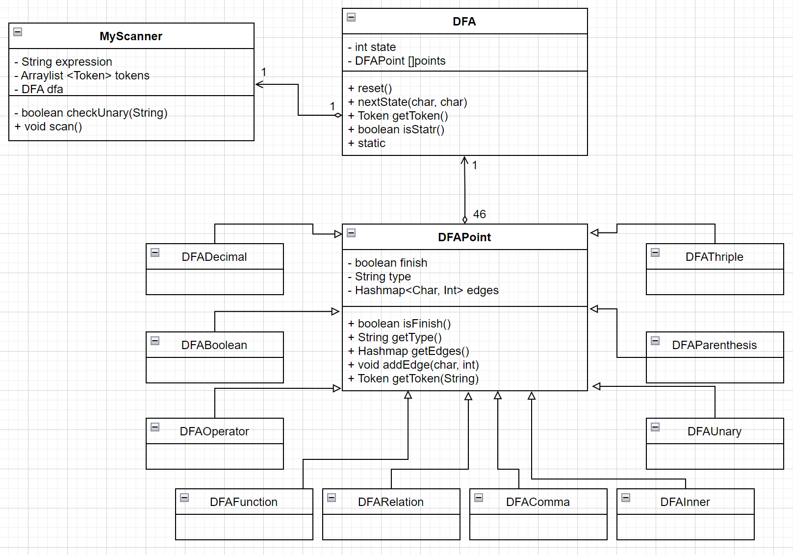

##### 3.1.4 parser

Calcator是整个工程的入口。Parser负责解析该表达式，如果产生了规约，则将规约的内容交给Reducer。Reducer作为一个工厂，产生了不同子表达式计算的商品，用于计算具体的表达式。

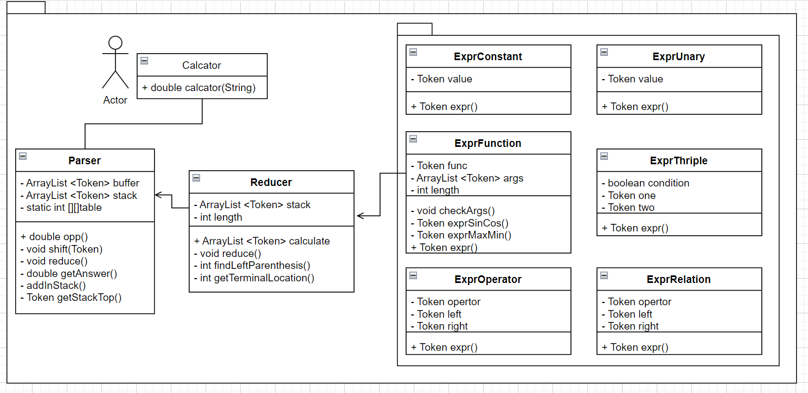


#### 3.2 设计模式

##### 3.2.1 工厂模式

在token和expr部分当中，token被细分成为很多具体的小类，而expr中也有很多不同的具体的计算方式。因此，在parser中，通过addInStack作为一个工厂函数，采用类似工厂模式的方式，根据token的不同类别，生产具体的token作为商品。而在reducer中，reducer作为一个工厂的存在，判断表达式属于哪一个类别，根据类别选择生产对应的商品expr用于计算表达式。

其中，token部分为抽象工厂模式，而expr部分为简单工厂模式。工厂模式极大程度地增加了代码的可扩展性。

##### 3.2.2 单例模式

在Calculator的入口处，生成了一个唯一的一个Reducer的实例。同样的，在Parser中，生成了唯一的一个Scanner实例。虽然在该实验中没有体现单例模式的具体用途，但是其可以确保所有对象都访问唯一实例，并且所以类可以灵活更改实例化过程。


### 4 测试报告

#### 4.1 标准测试

标准测试中包含对计算器大部分功能的基本检测，通过该测试后，EXPREVAL能够进行基本的工作。

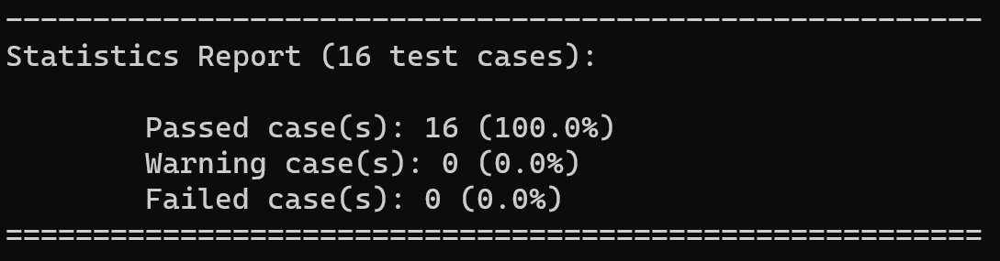

#### 4.2 大量测试

该测试数据包含111个测试用例，来源于网上。该测试用例包含了大量的测试，包括对基本功能的测试，以及对错误报告的测试。通过该测试，EXPREVAL能够在不刻意设置刁钻表达式的情况下，完成所有的功能。

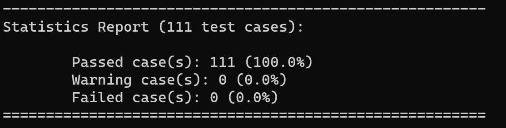

#### 4.3 错误测试

该测试用例在大量测试的基础上，新增了54个错误测试。该测试用例包含了对所有错误类型的测试。通过该测试，抛出的错误类型基本上是正确的。

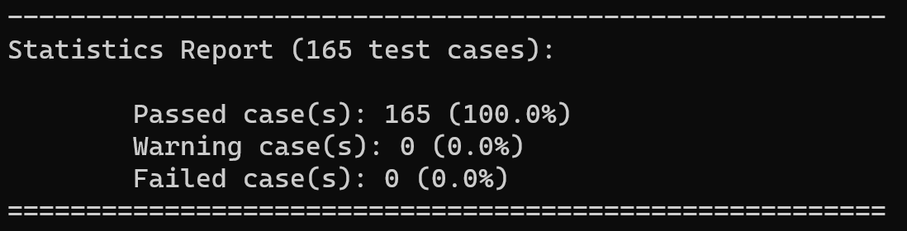


### 5 附件

#### 5.1 文件

各文件的描述如文档所示。

```
D:.
│  build.bat
│  design.pdf
|  README.txt
│  doc.bat
│  run.bat
│  test_exception.bat
│  test_lanly.bat
│  test_simple.bat
│  test_standard.bat
│
├─bin
│
├─doc
│
├─ref
│
├─src
│  ├─parser
│  │  │  Calculator.java
│  │  │  Parser.java
│  │  │  Reducer.java
│  │  │
│  │  └─expr
│  │          ExprConstant.java
│  │          ExprFunction.java
│  │          ExprOpreator.java
│  │          ExprRelation.java
│  │          ExprThriple.java
│  │          ExprUnary.java
│  │
│  ├─scanner
│  │  │  MyScanner.java
│  │  │
│  │  └─dfa
│  │          DFA.java
│  │          DFABoolean.java
│  │          DFAComma.java
│  │          DFADecimal.java
│  │          DFAFunction.java
│  │          DFAInner.java
│  │          DFAOperator.java
│  │          DFAParenthesis.java
│  │          DFAPoint.java
│  │          DFARelation.java
│  │          DFAThriple.java
│  │          DFAUnary.java
│  │
│  └─token
│          Decimal.java
│          Function.java
│          MyBoolean.java
│          Operator.java
│          Parenthesis.java
│          Relation.java
│          Symbol.java
│          Thriple.java
│          Token.java
│          Unary.java
│
└─testcases
        Exception.xml
        lanly.xml
        report.txt
        simple.xml
        standard.xml
```


#### 5.2 附录

1. 画DFA的快捷网站：[Finite State Machine Designer - by Evan Wallace (madebyevan.com)](https://www.madebyevan.com/fsm/)
2. 另一个画DFA的网站：[Webgraphviz](http://www.webgraphviz.com/)


#### 5.3 说明

具体应用说明见EXPREVAL文档。
